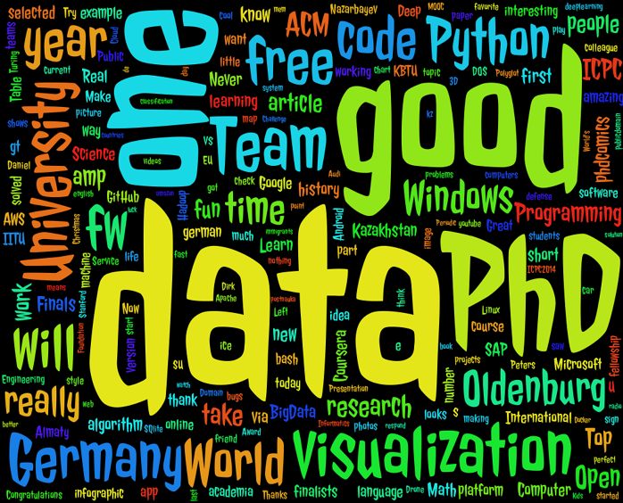
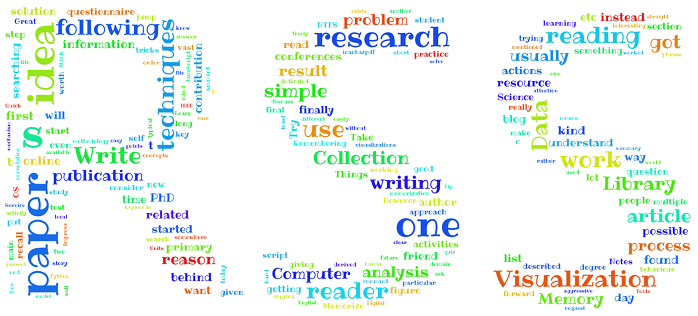

### About

Tiny python utility that converts data crawled from different services into cloud of words.

### Supported Services so Far
* [Twitter](https://twitter.com/)
* [ORCID](http://orcid.org/)
* [RSS](http://en.wikipedia.org/wiki/RSS)
* [Tumblr](https://www.tumblr.com/)
* [GitHub](https://github.com/)
* [Habrahabr](http://habrahabr.ru/)

### Examples Generated

**Twitter Timeline**



**ORCID (publications abstracts)**


**RSS Blog**


**Tumblr Text Blogs**


**GitHub Commits**


### Installation

**NOTE** This section lists only the main dependencies of the "services-to-wordcloud". Dependencies of the each service are described inside *READMEs* services's own [services folders](services).

Use 'pip' to install dependencies
```
pip install pyprind
pip install numpy
pip install matplotlib
pip install pandas
pip install scipy
```

Or use 'conda' from [Anaconda Scientific Python Distribution](https://store.continuum.io/cshop/anaconda/) to install dependencies (*better solutions in case you are new to python or Windows user*):
```
conda install matplotlib
conda install pyprind
conda install numpy
conda install pandas
conda install scipy
```

If you are not able to find package *'by default'* with ```'conda'```, please use 'binstar' to find proper binary of the package.
For example for 'twitter' looks as follows:
```
binstar search -t conda twitter
```

Installing [wordcloud](https://github.com/amueller/word_cloud) python package can be very tricky
```
conda install pil
pip install git+git://github.com/amueller/word_cloud.git
```

In case you really need to compile a python package on Windows, do not use MinGW, it won't work. Because the official compiler for the Python on Windows is *Microsoft Visual C++ Compiler*, the patch for your Windows can be found [here](http://www.microsoft.com/en-us/download/details.aspx?id=44266). Howeverm if you are fan of the MinGW and it's already installed and used as a "default" C and C++ compiler on your Windows machine, on the moment of the Python package compilation (while intalling [wordcloud](https://github.com/amueller/word_cloud)) is better to remove it from your %PATH% variable.

### Credits

* Heavily inspired by the article [Turn Your Twitter Timeline into a Word Cloud Using Python](http://sebastianraschka.com/Articles/2014_twitter_wordcloud.html#A.-Downloading-Your-Twitter-Timeline-Tweets) written by [@rasbt](https://github.com/rasbt)
* Fonts are taken from the various of places and initially distributed by the authors under one of the open licenses.
	- A huge collection of fonts can be found in the [googlefontdirectory github repository](https://github.com/w0ng/googlefontdirectory).
	- Another collection of fonts by [fontsquirrel](http://www.fontsquirrel.com/fonts/)
* Russian stopwords are taken from [stop-words](https://code.google.com/p/stop-words/)


### Author
* [Viktor Dmitriyev](https://github.com/vdmitriyev)

###  License

Check this file with [license](LICENSE)
